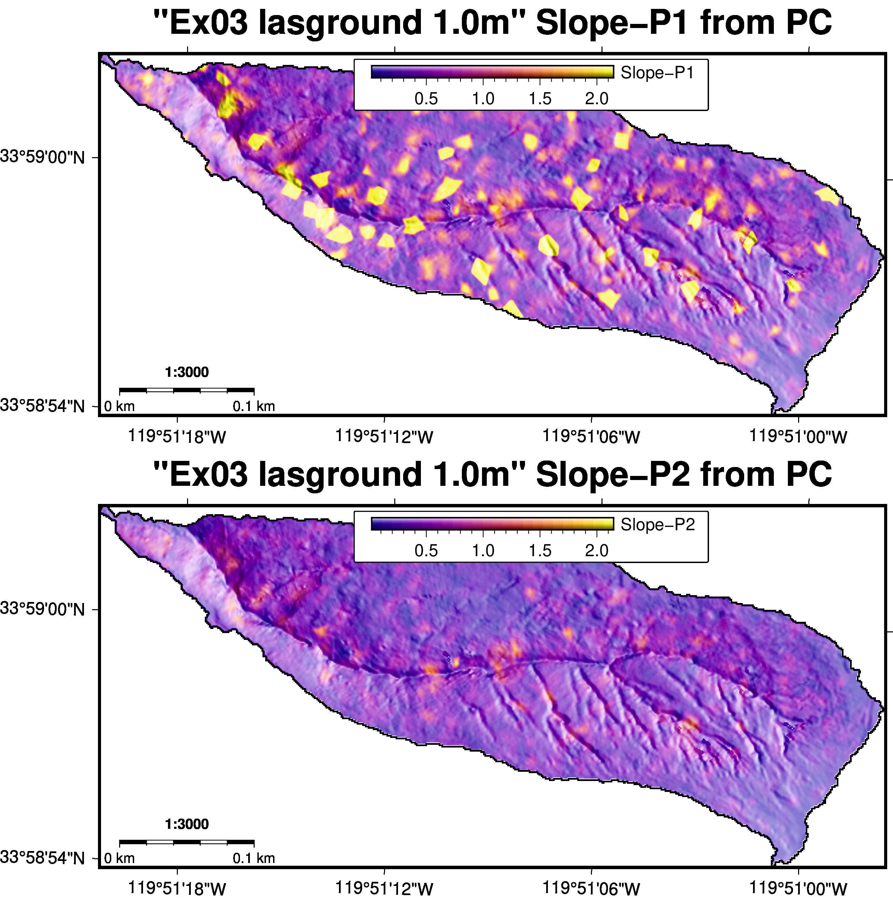
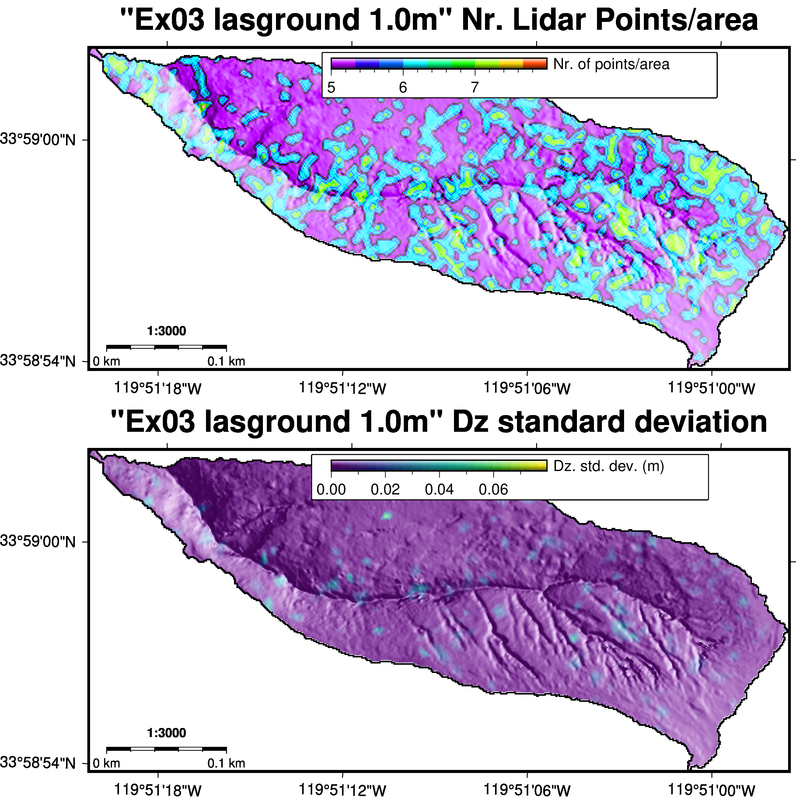

---
title: "*PC_geomorph_roughness*"
subtitle: "Pre-process and classify lidar or SfM point-cloud data for processing with *PC_geomorph_roughness*"
subject: "Geomorphology"
date: "December 2018"
author: "Bodo Bookhagen ([bodo.bookhagen@uni-potsdam.de](bodo.bookhagen@uni-potsdam.de))"
keywords: [Point Cloud, Classification, lidar, SfM, geomorphology]
titlepage: true
titlepage-rule-height: 2
logo: "figs/pozotitle.png"
logo-width: 360
toc-own-page: true 
listings-disable-line-numbers: true
disable-header-and-footer: true
footer-left: "none"
...

# Point Cloud (PC) Geomorphologic roughness analysis
This document-in-manual-style roughly outlines the steps necessary to take an unclassified, raw point cloud (PC), perform a ground classification using commercial or open-source tools, generate Digital Elevation Models (DEMs), calculate PC statistics for selected seed points (user inputs spacing), and generate interpolated GeoTIFF files for further processing and analysis. 


**The algorithm and an application for this code is described in:
Bingham, N., Bookhagen, B., Johnson, K., and Chadwick, O. (in review): Use of lidar point cloud data to assess human-induced erosion and loss of vegetation cover on contrasting lithologies**

**When using the code, please cite this paper!**


# Installation
*The preferred system to run this code is a Linux derivative, but using OS X or the Windows 10 Bash setup with Ubuntu will work as well. It will require additional work to make the code function on a Windows 10 only system without bash support.*

## Installation on Windows 10
Installation works best, if you use the Windows 10 Bash. There are several resources available on the internet that explain the [bash setup](https://www.windowscentral.com/how-install-bash-shell-command-line-windows-10). 
After the reboot, *wget* [miniconda](https://conda.io/miniconda.html) for [Linux 64 bit](https://repo.anaconda.com/miniconda/Miniconda3-latest-Linux-x86_64.sh) and install:

```bash
wget https://repo.anaconda.com/miniconda/Miniconda3-latest-Linux-x86_64.sh
bash Miniconda3-latest-Linux-x86_64.sh
```

Next, call:
```bash
conda config --prepend channels conda-forge/label/dev
conda config --prepend channels conda-forge
conda create -y -n PC_py3 python=3.6 pip scipy pandas numpy matplotlib \
	scikit-image gdal pdal xarray packaging ipython multiprocess \
	h5py lastools pykdtree spyder gmt=5* imagemagick
```

Activate the environment and install laspy
```bash
source activate PC_py3
pip install laspy
```

If you have LAStools installed, set the path within the bash.
```bash
export PATH=/mnt/c/LAStools/bin:$PATH
```

## Installation on Linux
This is a Python 3.x code that will run on any OS, which supports the packages. It runs and has been tested on Linux (Ubuntu/Debian), Windows 10, and Mac OS X. We are using [conda/miniconda](https://conda.io/docs/) to install the required packages, which can be [downloaded here](https://conda.io/miniconda.html). Follow [these instruction](https://conda.io/docs/user-guide/install/index.html) to get miniconda installed. In short:
```bash
wget https://repo.anaconda.com/miniconda/Miniconda3-latest-Linux-x86_64.sh
bash Miniconda3-latest-Linux-x86_64.sh
```

You will need several packages for python to run this code. These are standard packages and are included in all distributions. We create an environment called *PC_py3* (PointCloud-python3) in the following way (currently we are using Python 3.6, but  3.7 should work equally well):

```bash
conda config --prepend channels conda-forge/label/dev
conda config --prepend channels conda-forge
conda create -y -n PC_py3 python=3.6 pip scipy pandas numpy matplotlib \
    scikit-image gdal pdal xarray packaging ipython multiprocess \
    h5py lastools pykdtree spyder gmt=5* imagemagick
```

You can active this environment on the command line with
```source activate PC_py3```.

You don't need ipython or spyder to run this code and you can remove these repositories in the command line above, but they usually come in handy. Also, we are installing GMT5 for visualization purposes. If you don't plan to generate maps and/or use GMT, you can safely remove *gmt=5\** and *imagemagick* from the line above.

Next, Install a fast and simple LAS/LAZ reader/writer. You can do similar steps through *lastools*, but this interface is fairly simple to use. *Please note that laspy currently does not support writing LAZ files.*
```bash
source activate PC_py3
pip install laspy
```
If you have issues with pip, see: [here](https://stackoverflow.com/questions/47955397/pip3-error-namespacepath-object-has-no-attribute-sor).

This code uses [pykdtree](https://github.com/storpipfugl/pykdtree). There are other KDTree implementations, for example [scipy.spatial.cKDTree](https://docs.scipy.org/doc/scipy-0.19.1/reference/generated/scipy.spatial.cKDTree.html). But pykdtree is faster (but doesn't allow you to save the results such as cKDTree). Because we aim at very large point clouds, the pyKDTree algorithm is significantly faster for generating and querying the KDtree and will increase processing speed (we have run tests with 1e6 to 1e9 points).


## Installation of *PC_geomorph_roughness*
After the setup either on Ubuntu or Windows 10 Bash, install the repository into your favorite github directory, for example ~/github:
```bash
cd ~/github
git clone https://github.com/UP-RS-ESP/PC_geomorph_roughness
```

*You are now ready to run the code from the command line.*

## Install LAStools

## Install lidar2dem
The python-based tool [lidar2dem](http://applied-geosolutions.github.io/lidar2dems/) is a Python2 based list of modules and script. This is a useful implementation if you aim to classify many files in individual directories and convert them to a DTM. A nice workflow is provided. To take full advantage of some of the code's capabilities, we first need to install a python2-based environment:
```bash
conda create -y -n PC_py2 python=2* pip scipy pandas numpy matplotlib \
    scikit-image gdal pdal xarray packaging ipython multiprocess \
    h5py lastools pykdtree spyder gmt=5* imagemagick
source activate PC_py2
```
Installation into the home directory (alternatively, if sudo rights are available, install into /usr/local/src):

```bash
source activate PC_py2
pip install gippy 
cd ~
git clone https://github.com/Applied-GeoSolutions/lidar2dems.git
cd lidar2dems
./setup.py install
```

You are now ready to use *l2d_classify* and other tools from the lidar2dem scripts.


## Install points2grid
The code points2grid provides a useful environment for interpolating large, classified points. It does not classify a PC, but takes a classified PC and generates a DEM (or Digital Terrain Model) from it by local interpolation of the points. For more information see [OpenTopography points2grid webpage](http://opentopo.sdsc.edu/tools/viewTool?toolId=201), the [CRREL github webpage](https://github.com/CRREL/points2grid/), and follow the [Installation description](https://github.com/CRREL/points2grid/blob/master/INSTALL.md). In short, these are:
```bash
source activate PC_py3
conda install libcurl
cd ~
mkdir bin
git clone https://github.com/CRREL/points2grid.git
cd points2grid
mkdir build 
cd build
cmake .. -DCMAKE_INSTALL_PREFIX="~/"
make -j
make install
```

Make sure to add the path *~/bin* to the path variable
```bash
export PATH=~/bin:$PATH
export LD_LIBRARY_PATH=~/lib:$LD_LIBRARY_PATH
```

and you may want to add this permanently to your *.bashrc*:
```bash
echo "export PATH=~/bin:$PATH" >> ~/.bashrc
echo "export LD_LIBRARY_PATH=~/lib:$LD_LIBRARY_PATH" >> ~/.bashrc
```

# Point Cloud (PC) Classification
PC classification is not part of the manuscript and algorithm described. Here, we just show two approaches how to ground-classify a PC. You may know of others (and there are certainly many different ways to ground-classify PCs).

*We describe ground-classification using the commercial [LAStools](https://rapidlasso.com/lastools/) package and an open-source approach with [PDAL](https://pdal.io/).*

We focus on our analysis on three subcatchments in the Pozo catchments (example_01, example_01m example_03).
An oblique view of the Pozo catchment illustrates the steep terrain and diverse landcover (Figure \ref{Fig:PC_Pozo_color_intensity}).

 

## Classification with LAStools
*NOTE: [LAStools](https://rapidlasso.com/lastools/) is a commercial code and requires a license to be fully functional. An alternative to LAStools is described using PDAL's implementation of SMRF.*

First, we clip the catchment with [lasclip](https://rapidlasso.com/lastools/lasclip/) from a larger LAZ file containing ~69 Mio. points for the southwestern part of Santa Cruz Island (Figure \ref{Fig:PC_Pozo_color_intensity}). These data are stored in file *Pozo_USGS_UTM11_NAD83_all_color_nocl.laz* (not provided with these example, because it is too large for storage on github). But the entire dataset is freely available and can be obtained at [OpenTopography](https://opentopography.org/). 


### Clipping a PC
We use a shapefile in the same projection as the LAZ pointcloud to extract the subsetted, unclassified pointcloud. We have buffered this shapefile by 50m to make sure to include points from outside the drainage divide (derived from a 1m DEM) to avoid artifacts. Here we demonstrate this for catchment example_01 (coined catchment 16). 

*NOTE: Because we run these examples on an Ubuntu system, we use wine. If you are on a Mac OSX, the commands will be similar. On a Windows system, you can just use the .exe files (e.g., lasinfo.exe - if you have set the path variable correctly as shown above).*

```bash
cd example_01
wine /opt/LAStools/bin/lasclip.exe -i ../Pozo_USGS_UTM11_NAD83_all_color_nocl.laz -poly Pozo_DTM_noveg_UTM11_NAD83_cat16_b50m.shp -o Pozo_USGS_UTM11_NAD83_cat16.laz
```
The resulting point cloud has 1,245,618 points. Often, PCs from other sources come with pre-classified points. These often have not been verified and we suggest to remove previous classification and user flags with [lasclassify](https://rapidlasso.com/lastools/lasclassify/).
```bash
wine /opt/LAStools/bin/lasclassify.exe -i Pozo_USGS_UTM11_NAD83_cat16.laz -olaz -set_user_data 0 -set_classification 0 -o Pozo_USGS_UTM11_NAD83_cat16_uncl.laz
```

Next, we obtain PC density information using [lasinfo](https://rapidlasso.com/lastools/lasinfo/):
```
wine /opt/LAStools/bin/lasinfo.exe -i Pozo_USGS_UTM11_NAD83_cat16_uncl.laz -nh -nv -nmm -cd

lasinfo (180422) report for 'Pozo_USGS_UTM11_NAD83_cat16_uncl.laz'
number of first returns:        1234002
number of intermediate returns: 149
number of last returns:         1236327
number of single returns:       1224860
covered area in square units/kilounits: 152992/0.15
point density: all returns 8.14 last only 8.08 (per square units)
      spacing: all returns 0.35 last only 0.35 (in units)
overview over number of returns of given pulse: 1224860 20255 503 0 0 0 0
```

### Optional PC pre-processing
If you know you have a noisy dataset (for example from SfM data), filter by noise and isolated points:
```bash
wine /opt/LAStools/bin/lasnoise.exe -i Pozo_USGS_UTM11_NAD83_cat16_uncl.laz -step_xy 2 -step_z 1 -isolated 5 -olaz -o Pozo_USGS_UTM11_NAD83_cat16_uncln.laz
```

*NOTE: If you have SfM data you likely will need to do additional pre-processing steps to clean up your point cloud. *

### PC ground classification
Next, we perform the actual PC ground classification using [lasground](https://rapidlasso.com/lastools/lasground/). There are many different options and these likely will need to be fine tuned and adjusted to your area. Make sure to read the [README](http://www.cs.unc.edu/~isenburg/lastools/download/lasground_README.txt) and understand the various parameters.
Alternative to lasground you may consider using PDAL's implementation of SMRF (see below and [guide](https://pdal.io/workshop/exercises/analysis/ground/ground.html)).

```bash
wine /opt/LAStools/bin/lasground.exe -i Pozo_USGS_UTM11_NAD83_cat16_uncln.laz -by_flightline -wilderness -extra_fine -offset 0.25 -stddev 20 -step 1 -spike 0.5 -bulge 0.5 -olaz -o Pozo_USGS_UTM11_NAD83_cat16_clg.laz 
```
In the above steps, we ground-classify the PC. Ground points are assigned the class=2. There are several options to chose from: We allow an extra offset of 0.25m (25cm) and thereby include points to the ground class that may otherwise be filtered out. This is based on visual inspection of the results. Because the the point cloud is fairly dense (~8 pts/m2), we use a step size of 1m (Figure \ref{Fig:PC_cat16_color_intensity}).


If you prefer to use a stricter classification (i.e., fewer ground points are identified), you can use the standard parameters (but these are not fine tuned to the rough terrain of the Santa Cruz Island.
```bash
wine /opt/LAStools/bin/lasground.exe -i Pozo_USGS_UTM11_NAD83_cat16_uncln.laz -by_flightline -wilderness -extra_fine -olaz -o Pozo_USGS_UTM11_NAD83_cat16_clg_normal.laz 
```

*NOTE: You should always visually inspect your classified points using [displaz](http://c42f.github.io/displaz/) or [CloudCompare](https://www.danielgm.net/cc/) or something similar to make sure that the point-cloud classification performed well in the crucial areas.*
If you are not satisfied with your classification, you may want to experiment with [lasground_new](https://www.cs.unc.edu/~isenburg/lastools/download/lasground_new_README.txt):
```bash
wine /opt/LAStools/bin/lasground_new.exe -i Pozo_USGS_UTM11_NAD83_cat16_uncln.laz -wilderness -extra_fine -olaz -o Pozo_USGS_UTM11_NAD83_cat16_clg_lasground_new.laz 
```

*NOTE: We emphasize the importance of properly classifying your point cloud. If you have all natural terrain, it will be important to distinguish between ground and vegetation. In urban or suburban areas, you may want to further distinguish buildings from bare-earth lidar returns. It is essential that you spent time on the classification before proceeding with the analysis.*

Once you have identified the best point-cloud classification, you can save only the ground points to a separate file (i.e., a file containing only ground points). This will be used for the analysis with *PC_geomorph_roughness*.
```bash
wine /opt/LAStools/bin/las2las.exe -i Pozo_USGS_UTM11_NAD83_cat16_clg.laz -keep_class 2 -olaz -o Pozo_USGS_UTM11_NAD83_cat16_clg_cl2.laz
```

### PC vegetation classification
For some applications it may be useful to have a vegetation class defined. This can be achieved in several ways and the most straight forward approach is to rely on [lasclassify](https://rapidlasso.com/lastools/lasclassify/). This is not required for running *PC_geomorph_roughness*, but still may come in useful. In order for lasclassify to work, you will need to store the height above ground for every point. This can be achieved by running lasground with the option *-compute_height*. Assuming your lasground parameters are the first example from above (without -compute_height), we use:
```bash
wine /opt/LAStools/bin/lasheight.exe -i Pozo_USGS_UTM11_NAD83_cat16_clg.laz -olaz -o Pozo_USGS_UTM11_NAD83_cat16_clgh.laz 
```

Alternatively, you can attempt to run the height computation during the lasground classification, but this prevents the *-by_flightline* option:
```bash
wine /opt/LAStools/bin/lasground.exe -i Pozo_USGS_UTM11_NAD83_cat16_uncln.laz  -wilderness -extra_fine -offset 0.25 -stddev 20 -step 1 -spike 0.5 -bulge 0.5 -olaz -compute_height -o Pozo_USGS_UTM11_NAD83_cat16_clgh.laz 
```

The file containing height information stored in the user-data flag can be used for further classification:
```bash
wine /opt/LAStools/bin/lasclassify.exe -i Pozo_USGS_UTM11_NAD83_cat16_clgh.laz -ground_offset 0.5 -planar 0.1 -rugged 0.6 -olaz -o Pozo_USGS_UTM11_NAD83_cat16_clghc.laz 
```
The important options here are *-ground_offset* that determines the minimum height of vegetation or buildings. For the Santa Cruz Island, this can be set to a lower value of 0.5m. This will only consider points 0.5m above the ground to determine vegetation or buildings (often 1.5 or 2m are used). The options *-planar* and *-rugged* allow to control the identification of roofs (planar) and trees (rugged). In the study area, no buildings exist, but different vegetation types, so we have increased the rugged value. The results indicate a reasonable classification of vegetation (Figure \ref{Fig:PC_cat16_lower_color_intensity_classification}).

![Oblique view of the lower part of subcatchment 16 in the Pozo catchment. Left view shows the color image, middle image is the lidar intensity, right side shows the ground and vegetation-classified PC (brown-yellow colors indicate ground, green vegetation, and white points are unclassified). Further optimization could increase the detection limit of vegetation to include some of the lower brushes by decreasing the -ground_offset parameters (e.g., -ground_offset 0.35) and increasing the -rugged parameter (e.g., -rugged 0.8).\label{Fig:PC_cat16_lower_color_intensity_classification}](figs/PC_cat16_lower_color_intensity_classification.png)


### DTM from ground-classified PCs
Next, we generate a DTM from the ground-classified point cloud using [blast2dem](https://rapidlasso.com/blast/blast2dem/). This creates a TIN model of the surfaces and samples this at the required intervals. The output is stored in the subdirectory *dtm_interp* (interpolated Digital Terrain Model).

```bash
mkdir dtm_interp
wine /opt/LAStools/bin/blast2dem.exe -keep_class 2 -utm 11N -nad83 -meter -elevation_meter -merged -step 1 -i Pozo_USGS_UTM11_NAD83_cat16_clg_cl2.laz -o dtm_interp/Pozo_USGS_UTM11_NAD83_cat16_clg_cl2_1m.tif
```

If you intend to create a hillshade image for visualization, for example in QGIS, use:
```bash
wine /opt/LAStools/bin/blast2dem.exe -keep_class 2 -hillshade -utm 11N -nad83 -meter -elevation_meter -merged -step 1 -i Pozo_USGS_UTM11_NAD83_cat16_clg_cl2.laz -o dtm_interp/Pozo_USGS_UTM11_NAD83_cat16_clg_cl2_1m_HS.tif
```

In order to compare the outputs from the other classification schemes, we perform the same gridding on the other ground-classified PC (lasground_normal and lasground_new):
```bash
wine /opt/LAStools/bin/blast2dem.exe -keep_class 2 -utm 11N -nad83 -meter -elevation_meter -merged -step 1 -i Pozo_USGS_UTM11_NAD83_cat16_clg_normal.laz -o dtm_interp/Pozo_USGS_UTM11_NAD83_cat16_clg_cl2_normal_1m.tif
wine /opt/LAStools/bin/blast2dem.exe -keep_class 2 -utm 11N -nad83 -meter -elevation_meter -merged -step 1 -i Pozo_USGS_UTM11_NAD83_cat16_clg_lasground_new.laz -o dtm_interp/Pozo_USGS_UTM11_NAD83_cat16_clg_cl2_\
lasground_new_1m.tif
```

The resulting grids (Figures \ref{Fig:Cat16_lasground_comparison} and \ref{Fig:Cat16_lasground_diff}) indicate some differences (hillshade and DEM differences), but overall the classifications are comparable. Still, for detailed PC  analysis it is important to have especially the low and high points properly classified.

*NOTE: Before we can compare the grid, we will need to ensure that they are aligned to each other. The safest (and easiest) way of doing that is to make certain that the UTM coordinates of the grid (or GeoTIFF) is aligned with integer UTM coordinates. Second, we also want to cut the regions outside the catchment to avoid including border artifacts.*

These steps have been included in the GMT bash shell file (example01/example01_create_DEM_comparison_ground_classification_gmt.sh). This can be achieved with:
```bash
DEM1=dtm_interp/Pozo_USGS_UTM11_NAD83_cat16_clg_cl2_1m.tif
SHAPEFILE=Pozo_DTM_noveg_UTM11_NAD83_cat16.shp
gdalwarp $DEM1 foo.tif -tap -tr 1 1 -r bilinear -cutline $SHAPEFILE -crop_to_cutline -co COMPRESS=DEFLATE -co ZLEVEL=7 -co predictor=3
```

{height=90%}

{height=90%}


### Comparison of ground-classified PCs
A more direct way of comparison at the point-cloud level is to calcuate the [Hausdorff Distance](https://pdal.io/apps/hausdorff.html). Here we use the adjusted lasground classification as a reference PC and first create ground-classified LAZ files:

```bash
wine /opt/LAStools/bin/las2las.exe -i Pozo_USGS_UTM11_NAD83_cat16_clg.laz -keep_class 2 -olaz -o Pozo_USGS_UTM11_NAD83_cat16_clg_cl2.laz
wine /opt/LAStools/bin/las2las.exe -i Pozo_USGS_UTM11_NAD83_cat16_clg_lasground_new.laz -keep_class 2 -olaz -o Pozo_USGS_UTM11_NAD83_cat16_clg_lasground_new_cl2.laz
wine /opt/LAStools/bin/las2las.exe -i Pozo_USGS_UTM11_NAD83_cat16_clg_normal.laz -keep_class 2 -olaz -o Pozo_USGS_UTM11_NAD83_cat16_clg_normal_cl2.laz
pdal hausdorff Pozo_USGS_UTM11_NAD83_cat16_clg_cl2.laz Pozo_USGS_UTM11_NAD83_cat16_clg_normal_cl2.laz
pdal hausdorff Pozo_USGS_UTM11_NAD83_cat16_clg_cl2.laz Pozo_USGS_UTM11_NAD83_cat16_clg_lasground_new_cl2.laz
```

The Hausdorff distance between the PCs classified with the adjusted parameters and with standard parameters is:
```javascript
{
  "filenames":
  [
    "Pozo_USGS_UTM11_NAD83_cat16_clg_cl2.laz",
    "Pozo_USGS_UTM11_NAD83_cat16_clg_normal_cl2.laz"
  ],
  "hausdorff": 5.090078585,
  "pdal_version": "1.7.2 (git-version: a71df1)"
}
```

The Hausdorff distance between the PCs classified with the adjusted parameters and with a revised version of lasground is:
```javascript
{
  "filenames":
  [
    "Pozo_USGS_UTM11_NAD83_cat16_clg_cl2.laz",
    "Pozo_USGS_UTM11_NAD83_cat16_clg_lasground_new_cl2.laz"
  ],
  "hausdorff": 3.1808961,
  "pdal_version": "1.7.2 (git-version: a71df1)"
}
```

## Processing with PDAL
PDAL is an open-source point cloud library that provides easy access to the [PCL](http://pointclouds.org/). It is very powerful, but not specifically designed to process lidar or SfM PCs. However, it provides some simple approaches to ground-classify terrain that we will explore here
*NOTE: Vegetation classification with PDAL is possible, but requires several steps. These are not covered in this manual.*


### Ground classification with PDAL's implementation of SMRF
We rely on the Simple Morphological Filter [SMRF](https://pdal.io/stages/filters.smrf.html#filters-smrf) that can be accessed through *pdal translate* (or use your own pipeline). There is a step-by-step [instruction](https://pdal.io/workshop/exercises/analysis/ground/ground.html).

```bash
pdal translate \
   Pozo_USGS_UTM11_NAD83_cat16.laz \
   -o Pozo_USGS_UTM11_NAD83_cat16_smrf.las \
   smrf 
```

*NOTE: On some miniconda/anaconda installation, the writing to LAZ (compressed LAS) files is not supported. Change the output filename to .las instead.*

There are several options to adjust, especially *--filters.smrf.scalar*, *-filters.smrf.slope*, *-filters.smrf.threshold*, and *--filters.smrf.window*. But the standard options provide reasonable results (Figure \ref{Fig:PC_cat16_intensity_smrf_pmf_classification}).

If you would like to save ground-class only points to a separate file, use the range filter:
```bash
pdal translate Pozo_USGS_UTM11_NAD83_cat16_smrf.las -o Pozo_USGS_UTM11_NAD83_cat16_smrf_cl2.las
range --filters.range.limits="Classification[2:2]"
```

You can combine this with the ground-classification into:
```bash
pdal translate \
   Pozo_USGS_UTM11_NAD83_cat16.laz \
   -o Pozo_USGS_UTM11_NAD83_cat16_smrf_cl2.las \
   smrf range --filters.range.limits="Classification[2:2]"
```

In addition, you can include a simple outliers filter, ignore noise points (usually class=7) and save only the ground-classified points:

```bash
pdal translate \
   Pozo_USGS_UTM11_NAD83_cat16.laz \
   -o Pozo_USGS_UTM11_NAD83_cat16_smrf_cl2.las \
   outlier smrf range \
   --filters.outlier.method="statistical" \
   --filters.outlier.mean_k=8 \
   --filters.outlier.multiplier=3.0 \
   --filters.smrf.ignore="Classification[7:7]" \
   --filters.range.limits="Classification[2:2]" \
   --writers.las.compression=true
```

These results are comparable to the adjusted lasground parameters. The Hausdorff distance is comparable to LAStools' adjusted lasground classifications. 
```bash
pdal hausdorff Pozo_USGS_UTM11_NAD83_cat16_clg_cl2.laz Pozo_USGS_UTM11_NAD83_cat16_smrf_cl2.las
```

The Hausdorff distance is 
```javascript
{
  "filenames":
  [
    "Pozo_USGS_UTM11_NAD83_cat16_clg_cl2.laz",
    "Pozo_USGS_UTM11_NAD83_cat16_smrf_cl2.las"
  ],
  "hausdorff": 4.910509139,
  "pdal_version": "1.7.2 (git-version: a71df1)"
}
```

### Ground classification with PDAL's implementation of PMF
Next, we use the Progressive Morphological Filter [PMF](https://pdal.io/stages/filters.pmf.html#filters-pmf) that can be accessed through pdal translate (or use your own pipeline):

```bash
pdal translate \
   Pozo_USGS_UTM11_NAD83_cat16.laz \
   -o Pozo_USGS_UTM11_NAD83_cat16_pmf.las \
   pmf 
```

The PMF filter will require setting additional parameters to use it for ground classification of the Pozo-catchment data (Figure \ref{Fig:PC_cat16_intensity_smrf_pmf_classification}).

```bash
pdal translate \
   Pozo_USGS_UTM11_NAD83_cat16.laz \
   -o Pozo_USGS_UTM11_NAD83_cat16_pmf.las \
   pmf \
   --filters.pmf.slope=2 \
   --filters.pmf.exponential=false \
   --filters.pmf.initial_distance=1 \
   --filters.pmf.max_distance=4
```

Or combined into one longer code block with filtering and writing only class 2 points:
```bash
pdal translate \
   Pozo_USGS_UTM11_NAD83_cat16.laz \
   -o Pozo_USGS_UTM11_NAD83_cat16_smrf_cl2.laz \
   outlier pmf range \
   --filters.outlier.method="statistical" \
   --filters.outlier.mean_k=8 \
   --filters.outlier.multiplier=3.0 \
   --filters.pmf.ignore="Classification[7:7]" \
   --filters.pmf.slope=2 \
   --filters.pmf.exponential=false \
   --filters.pmf.initial_distance=1 \
   --filters.pmf.max_distance=4
   --filters.range.limits="Classification[2:2]" \
   --writers.las.compression=true
```

However, even with these aggressive filtering options, the PMF doesn't perform well in the very steep and rugged terrain of Santa Cruz Island.


### Generating a DTM with PDAL
You can interpolate the ground-classified points from SMRF onto a gridded DEM using [pdal's DTM pipeline](https://pdal.io/workshop/exercises/analysis/dtm/dtm.html). This approach relies on [writers.gdal](https://pdal.io/stages/writers.gdal.html#writers-gdal), which in turn relies on [Points2Grid](https://opentopography.org/otsoftware/points2grid). For gdal.writes currently exists no command line support. Generate a file containing the necessary information to run a PDAL pipeline (call it *example01_gdal_smrf.json*). For the SMRF ground-classified file, we use:

*NOTE: You may want to look into otbcli_splitimage -in <in_file.tif> -out <out_file.tif> if you have trouble reading the tif file.*

```javascript
{
"pipeline": [
	"Pozo_USGS_UTM11_NAD83_cat16_smrf_cl2.las",
	{
		"filename":"dtm_interp/Pozo_USGS_UTM11_NAD83_cat16_smrf_cl2_Zmean.tif",
		"gdaldriver":"GTiff",
		"data_type":"float",
		"dimension":"Z",
		"output_type":"mean",
		"resolution":"1.0",
		"type": "writers.gdal"
	}
]
}
```

Then run this with:
```bash
pdal pipeline --nostream example01_gdal_smrf.json
```

You can extract additional *output_type*, for example idw, stdev, count. Most importantly, you can overwrite existing parameters on the command line with:
```bash
pdal pipeline --nostream example01_gdal_smrf.json \
    --writers.gdal.dimension="Intensity" \
    --writers.gdal.data_type="float" \
    --writers.gdal.output_type="mean" \
    --writers.gdal.filename=\
	"dtm_interp/Pozo_USGS_UTM11_NAD83_cat16_smrf_cl2_intensity_mean.tif"
```

In a second step and in order to compare the interpolation algorithms from classified point clouds, we use the same PC (classified with the adjusted lasground parameters) and use blast2dem compared to the local points2grid interpolation scheme implemented in gdal.writer. We generate the pipeline *example01_gdal_lasground.json*:
```javascript
{
"pipeline": [
	"Pozo_USGS_UTM11_NAD83_cat16_clg_cl2.laz",
	{
		"filename":"dtm_interp/Pozo_USGS_UTM11_NAD83_cat16_lasground_cl2_Zmean.tif",
		"gdaldriver":"GTiff",
		"data_type":"float",
		"dimension":"Z",
		"output_type":"mean",
		"resolution":"1.0",
		"type": "writers.gdal"
	}
]
}
```

Then run this with:
```bash
pdal pipeline --nostream example01_gdal_lasground.json
```

The output maps view of these interpolated surfaces are compared to other gridding methods (Figure \ref{Fig:Cat16_smrf_PDAL_intensity_diff}). 

![Map view of the PDAL SMRF classified DEM. Gridding was performed through the PDAL's writer.gdal approach. Intensity (top) and difference between adjusted lasground-classified PC and point2grid interpolated DTM (middle) is shown. Bottom illustrates the differences between the lasground-classified PC gridded with blast2dem minus gdal.writer. Note that points with high curvature appear to show the largest difference between the interpolation methods. The bash script for generating this figure is: example_01/example01_create_PDAL_SMRF_gdal_writer_gmt.sh. \label{Fig:Cat16_smrf_PDAL_intensity_diff}](figs/Cat16_lasground_PDAL_diff.png){height=85%}

### Combined PDAL pipeline using filtering steps and SMRF classification
We can combine several steps in a PDAL pipeline to generate a ground-classified PC. In this pipeline, we first assign the class 0 to all points, perform an [Extended Local Minimum](https://pdal.io/stages/filters.elm.html#filters-elm) filter, remove [outliers](https://pdal.io/stages/filters.outlier.html#filters-outlier), perform [SMRF](https://pdal.io/stages/filters.smrf.html#filters-smrf) ground segmentation and only write the ground-classified files to a file using a [range filter](https://pdal.io/stages/filters.range.html#filters-range). 
The pipeline is stored in [example_01/example01_PDAL_SMRF_pipeline.json](example_01/example01_PDAL_SMRF_pipeline.json):

```javascript
{
  "pipeline":[
    {
      "type":"filters.assign",
      "assignment":"Classification[:]=0"
    },
    {
      "type":"filters.elm",
      "cell":10.0,
      "threshold":2.0,
      "class":7
    },
    {
      "type":"filters.outlier"
    },
    {
      "type":"filters.smrf",
      "last":true,
      "ignore":"Classification[7:7]",
      "cell":1.0,
      "slope":0.2,
      "window":20,
      "threshold":0.8,
      "scalar":1.2
    },
    {
      "type":"filters.range",
      "limits":"Classification[2:2]"
    }
  ]
}
```

The pipeline is run with the following command:
```bash
pdal translate Pozo_USGS_UTM11_NAD83_cat16.laz Pozo_USGS_UTM11_NAD83_cat16_SMRF_cl2.las --json example01_PDAL_SMRF_pipeline.json
```

This can be written to a DTM (nodata value = -9999) with the following pipeline [example01_writers_gdal_smrf_Zmean_1m.json]():
```javascript
{
"pipeline": [
	"Pozo_USGS_UTM11_NAD83_cat16_SMRF_cl2.las",
	{
		"filename":"dtm_interp/Pozo_USGS_UTM11_NAD83_cat16_smrf_cl2_Zmean_1m.tif",
		"gdaldriver":"GTiff",
		"output_type":"mean",
		"data_type":"float",
		"resolution":"1.0",
		"dimension":"Z",
		"type": "writers.gdal"
	}
]
}
```
and run with:

```bash
pdal pipeline --nostream example01_writers_gdal_smrf_Zmean_1m.json
```

It is recommended that you clip that DEM with the shapefile outlining the catchment to remove interpolation artifacts (remember, we have added a 50m buffer for that reason). There are different ways of doing this, here we use [gdalwarp](https://www.gdal.org/gdalwarp.html). We first warp to a temporary file and then move the temporary file back to the original file. Note the option *-tap* that aligns the DEM to an integers-spaced UTM grid:

```bash
DEM_MN_GRD=dtm_interp/Pozo_USGS_UTM11_NAD83_cat16_smrf_cl2_Zmean.tif
SHAPEFILE=Pozo_DTM_noveg_UTM11_NAD83_cat16.shp
gdalwarp $DEM_MN_GRD foo.tif -tap -tr 1 1 -r bilinear -cutline $SHAPEFILE -crop_to_cutline -co COMPRESS=DEFLATE -co ZLEVEL=7 -co predictor=3
mv foo.tif $DEM_MN_GRD
```

### Generating a DTM with from a PC with GDAL
Alternatively, you can interpolate the points from a point cloud to a gridded dataset using [gdal_grid](https://www.gdal.org/gdal_grid.html). There are more versatile options available that allow to experiment with different algorithms. This requires that the LAZ file will be written to a CSV or similar file format that is readable by GDAL. In *PC_geomorph_roughness*, we use *gdal_grid* in the Python code to interpolate the seed points written as CSV, converted to VRT format to a grid.

First, write to CSV file using open-source las2las:
```bash
las2las -i Pozo_USGS_UTM11_NAD83_cat16_smrf_cl2.las -o Pozo_USGS_UTM11_NAD83_cat16_smrf_cl2.csv -oparse xyz
```

Second, add a header X,Y,Z,c,i,R,G,B and replace <space> with ,:
```bash
sed -i '1s/^/X,Y,Z\n/' \
    Pozo_USGS_UTM11_NAD83_cat16_smrf_cl2.csv
sed -i 's/ /,/g' \
    Pozo_USGS_UTM11_NAD83_cat16_smrf_cl2.csv
```

Third, create a VRT file to control how gdal is reading this file. Create a file called Pozo_USGS_UTM11_NAD83_cat16_smrf_cl2.vrt with content:
```javascript
<OGRVRTDataSource>
    <OGRVRTLayer name="Pozo_USGS_UTM11_NAD83_cat16_smrf_cl2">
        <SrcDataSource>Pozo_USGS_UTM11_NAD83_cat16_smrf_\
        cl2.csv</SrcDataSource>
        <GeometryType>wkbPoint</GeometryType>
        <GeometryField encoding="PointFromColumns" x="X" y="Y" z="Z"/>
    </OGRVRTLayer>
</OGRVRTDataSource>
```

Fourth, we can convert the csv file to any GIS format. We use *ogr2ogr* for this. For example, converting it to a shapefile format (make sure to set proper EPSG information for proper projection):
```bash
ogr2ogr -oo KEEP_GEOM_COLUMNS=NO -oo GEOMETRY=AS_XYZ \
    -oo SEPARATOR=COMMA -oo AUTODETECT_WIDTH=YES \
    -oo HEADERS=AUTO -oo AUTODETECT_SIZE_LIMIT=0 \
    -oo AUTODETECT_TYPE=YES \
    -t_srs epsg:26911 -s_srs epsg:26911 \
    Pozo_USGS_UTM11_NAD83_cat16_smrf_cl2.shp \
    Pozo_USGS_UTM11_NAD83_cat16_smrf_cl2.vrt
```

Fifth, the shapefile can be interpolated to a grid using *gdal_grid*. We need the following parameters:

1. *X and Y extent.* The output from
    
    ```bash
    ogrinfo -ro -so Pozo_USGS_UTM11_NAD83_cat16_smrf_cl2.shp Pozo_USGS_UTM11_NAD83_cat16_smrf_cl2
    ```
    
    can be piped throgh awk to obtain the extents:
    
    ```bash
    ogrinfo -ro -so Pozo_USGS_UTM11_NAD83_cat16_smrf_cl2.shp Pozo_USGS_UTM11_NAD83_cat16_smrf_cl2 | awk '/Extent: /'
    ```
    
    The xmin, ymin, and xmax, ymax values will need to be put into variables:
    
    ```bash
    xmin=236141.010000
    ymin=3763743.940000
    xmax=236824.920000
    ymax=3764111.850000
    ```

2. *Number of rows and columns.* We also define the number of rows and columns for a 1m DEM by calculating xmax-xmin and ymax-ymin.

    ```bash
    ncols=684
    nrows=368
    ```

3. *Defining the interpolation method.* *gdal_grid* allows several interpolation methods and we experiment with two: linear interpolation and inverse distance weighted (IDW). We define:

    ```bash
    linear="linear:radius1=2:radius2=3:angle=0.0:nodata=-9999"
    ```

    For IDW, we use a specific implementation that relies on nearest neighbor searching with an efficient way of defining a maximum number of neighbor points to be used. Both examples set nodata/NaN to -9999:

    ```bash
    idw="invdistnn:radius=2.0:max_points=50:min_points=1:nodata=-9999"
    ```

4. *Interpolating to a grid.* We use the option *GDAL_NUM_THREADS ALL_CPUS* to use all available cores for the interpolation.

    ```bash
    gdal_grid --config GDAL_NUM_THREADS ALL_CPUS -of GTiff -co PREDICTOR=3 -co COMPRESS=DEFLATE -co ZLEVEL=7 -ot Float32 -txe $xmin $xmax -tye $ymin $ymax -zfield Z -a $linear -outsize $ncols $nrows -a_srs epsg:26911 Pozo_USGS_UTM11_NAD83_cat16_smrf_cl2.shp dtm_interp/Pozo_USGS_UTM11_NAD83_cat16_smrf_cl2_linear_1m.tif
    ```

    and

    ```bash
    gdal_grid -of GTiff -co PREDICTOR=3 -co COMPRESS=DEFLATE -co ZLEVEL=7 -ot Float32 -txe $xmin $xmax -tye $ymin $ymax -zfield Z -a $idw -outsize $ncols $nrows -a_srs epsg:26911 Pozo_USGS_UTM11_NAD83_cat16_smrf_cl2.shp dtm_interp/Pozo_USGS_UTM11_NAD83_cat16_smrf_cl2_idw_1m.tif
    ```

5. *Clip and warp interpolated GeoTIFF.* The interpolation will result in border artifacts that will need to be clipped. We use the shapefile Pozo_DTM_noveg_UTM11_NAD83_cat16.shp. Second, we inteprolate the grid to a 1m grid spacing and make sure that the grid is aligned with integer UTM coordinates *-tap*.

    ```bash
    gdalwarp -tap -tr 1 1 -r bilinear --config GDAL_NUM_THREADS ALL_CPUS -co PREDICTOR=3 -co COMPRESS=DEFLATE -co ZLEVEL=7 -t_srs epsg:26911 -srcnodata -9999 -dstnodata -9999 -ot Float32 -crop_to_cutline -cutline Pozo_DTM_noveg_UTM11_NAD83_cat16.shp dtm_interp/Pozo_USGS_UTM11_NAD83_cat16_smrf_cl2_linear_1m.tif dtm_interp/Pozo_USGS_UTM11_NAD83_cat16_smrf_cl2_linear_1m_clip.tif
    ```
    
    and
    
    ```bash
    gdalwarp -tap -tr 1 1 -r bilinear --config GDAL_NUM_THREADS ALL_CPUS -co PREDICTOR=3 -co COMPRESS=DEFLATE -co ZLEVEL=7 -t_srs epsg:26911 -srcnodata -9999 -dstnodata -9999 -ot Float32 -crop_to_cutline -cutline Pozo_DTM_noveg_UTM11_NAD83_cat16.shp dtm_interp/Pozo_USGS_UTM11_NAD83_cat16_smrf_cl2_idw_1m.tif dtm_interp/Pozo_USGS_UTM11_NAD83_cat16_smrf_cl2_idw_1m_clip.tif
    ```

The interpolated output tifs show differences: The IDW interpolation provides the closest results to the *blast2dem* approach, especially in the steeper areas (Figure \ref{Fig:Cat16_lasground_PDAL_diff}). 


{height=90%}


## Interpolation to a grid: points2grid
This method is implemented by PDAL's [writers.gdal](https://pdal.io/stages/writers.gdal.html) approach.
[Points2Grid](https://opentopography.org/otsoftware/points2grid). You can use the source code to run the interpolation to a grid from a ground-classified PC from the command line with points2grid.


## Classifying ground points with lidar2dem

See `l2d_classify -h`. Not implemented yet.


# Point Cloud (PC) Subsampling
Subsampling of PCs can be applied for some ground-classified PCs that are very dense and noisy. In some cases, we may just want to get initial results very fast - using fewer points will help to do that. 


## PC Decimation and filtering with PDAL
PDAL provides some [culling](https://pdal.io/stages/filters.html#cull) filters that can be directly applied on the classified PC (or also on the raw, unclassified PC). Most notably are [Poisson Subsampling](https://pdal.io/stages/filters.sample.html#filters-sample), [Decimation](https://pdal.io/stages/filters.decimation.html#filters-decimation), and [Voxelgrids](https://pdal.io/stages/filters.voxelgrid.html#filters-voxelgrid).

Applying a [Poisson Subsampling](https://pdal.io/stages/filters.sample.html#filters-sample) to the lasground-classified PC with a minimum distance between the points of 0.25m can be achieved with the pipeline *example01_Possion_sampling.json*:
```javascript
{
  "pipeline":[
    {
        "type": "readers.las",
        "filename": "Pozo_USGS_UTM11_NAD83_cat16_clg_cl2.laz"
    },
    {
        "type":"filters.sample",
        "radius": 0.5
    },
    {
      "type":"writers.las",
      "filename":"Pozo_USGS_UTM11_NAD83_cat16_clg_cl2_radius50cm.las"
    }
  ]
}
```
Then run this with:
```bash
pdal pipeline example01_Possion_sampling.json
```

The Poisson sub sampled (filtered) PC has been decimated, but the PC's structure has been maintained (Figure \ref{Fig:Cat16_PC_zoom_poisson_sampling}). 


{height=90%}


Decimation can be carried out with the following pipeline *example01_decimation_sampling.json*:

```javascript
{
  "pipeline":[
    {
        "type": "readers.las",
        "filename": "Pozo_USGS_UTM11_NAD83_cat16_clg_cl2.laz"
    },
    {
        "type":"filters.decimation",
        "step": 10
    },
    {
      "type":"writers.las",
      "filename":"Pozo_USGS_UTM11_NAD83_cat16_clg_cl2_step10.las"
    }
  ]
}
```

Then run this with:
```bash
pdal pipeline --nostream example01_Possion_sampling.json
```

# Point Cloud (PC) Geomorphologic roughness calculation and topographic detrending
Detrending Point Cloud (PC) data with slope and calculating topographic roughness and curvature from PCs.

The code reads in a ground-classified PC from a LAS/LAZ file and calculates several geomorphology-relevant metrics on the PC. Input files can be from a lidar or a Structure-from-Motion (SfM) PC, but should be ground classified (for descriptions on how to ground-classify your data, see previous sections).
You may also want to subsample your point cloud to generate a more homogenous point cloud. However, we provide a PC density-based subsampling method that homogenizes the PC density by either giving a fraction (or percentage) of points to be used (e.g., 0.8) or the number of neighborhood points for 1m grid spacing.

The algorithm allows defining a radius which is used to fit a linear plane through the point cloud to detrend the data (i.e., normalize the point cloud with mean elevation of 0). These data are used to calculate deviations from the mean (roughness) and identify rills, arroyos, incised canyons, and other forms of erosion processes. By varying the radius over which the plane is fitted, several scales of the landscape can be analyzed (similar to varying radii of topographic relief).  The algorithm choses seed points from the PC with a user-defined spacing (for example 1m) and calculated statistics for each seed point with that given radius. 

Output includes a set of shapefile and geotiffs that show statistics of the PC within the given radius. Also, CSV and H5 files are created that contain lists of seed point location and statistical results for further analysis in Python or Matlab.

The code is parallized using *multiprocess* and uses by default all available cores. This significantly speeds up statistic calculation of the point coud. For large point clouds, a significant amount of RAM is required or you will need to split your point cloud into smaller tiles.


The code performs several additional steps that are described in detail below. In summary, these are:

1. Finding seed points with a given spacing, usually 1m to 5m.

2. For each seed point and its neighborhood (for 1m spacing of seed points points within a radius of 0.5m  are used), statistics are calculated from the PC (and all points). These include, for example slope, curvature, variability of height (Z) values (for a full list and detailed description see the manual). The parameters also allow detrending the points within the seed-point radius by its slope and derive surface-roughness parameters.

3. The code allows to subsample a point cloud either by a max. number of neighborhood points (e.g., k=5) or by defining a fraction of points to use to create a point cloud with approximately similar point-cloud density based on probabilities. This step of point-cloud homogenization can also be performed by other approaches (see for example [PDAL filters](https://pdal.io/stages/filters.html). The subsampled point cloud is written as a new LAS file.

4. The code interpolates the seed points to a grid and writes the output as a geotiff. In addition, a point cloud generates a LAS file of all seed points with the relevant metric.

5. If GMT is installed (and that opion is chosen), a set of output maps is generated for initial visualization. 

## Input Parameters and options
*NOTE: pc_geomorph_roughness relies on a PC containing only ground points. *

Before running, make sure the proper environment is activated:
```bash
source activate PC_py3
```

List of argument is obtained by
```bash
python ~/PC_geomorph_roughness/pc_geomorph_roughness.py
```
resulting in:
```bash
usage: pc_geomorph_roughness.py [-h] -i INLAS [--raster_m RASTER_M]
                                [--raster_m_range RASTER_M_RANGE]
                                [--subsample_1m_pc_k SUBSAMPLE_1M_PC_K]
                                [--subsample_1m_pc_p SUBSAMPLE_1M_PC_P]
                                [--redo_subsample_1m_pc_p REDO_SUBSAMPLE_1M_PC_P]
                                [--k_nr_of_neighbors K_NR_OF_NEIGHBORS]
                                [--dem_fname DEM_FNAME]
                                [--shapefile_clip SHAPEFILE_CLIP]
                                [--epsg_code EPSG_CODE]
                                [--create_shapefiles CREATE_SHAPEFILES]
                                [--create_geotiff CREATE_GEOTIFF]
                                [--create_gmt CREATE_GMT]
                                [--create_las CREATE_LAS]
                                [--mean_z_only MEAN_Z_ONLY]
                                [--nr_of_cores NR_OF_CORES]
                                [--max_nr_of_neighbors_kdtree MAX_NR_OF_NEIGHBORS_KDTREE]
                                [--pt_lower_threshold PT_LOWER_THRESHOLD]
                                [--create_gmt_maps CREATE_GMT_MAPS]
                                [--gmt_title GMT_TITLE]
                                [--gmt_basename GMT_BASENAME]
                                [--plot_plane_fits PLOT_PLANE_FITS]
                                [--plot_plane_fits_nr_points PLOT_PLANE_FITS_NR_POINTS]
```

An extended help for each parameters is obtained by
```bash
python ~/PC_geomorph_roughness/pc_geomorph_roughness.py -h
```
With explanation of input parameters in:
```bash
usage: pc_geomorph_roughness.py [-h] -i INLAS [--raster_m RASTER_M]
                                [--raster_m_range RASTER_M_RANGE]
                                [--subsample_1m_pc_k SUBSAMPLE_1M_PC_K]
                                [--subsample_1m_pc_p SUBSAMPLE_1M_PC_P]
                                [--redo_subsample_1m_pc_p REDO_SUBSAMPLE_1M_PC_P]
                                [--k_nr_of_neighbors K_NR_OF_NEIGHBORS]
                                [--dem_fname DEM_FNAME]
                                [--shapefile_clip SHAPEFILE_CLIP]
                                [--epsg_code EPSG_CODE]
                                [--create_shapefiles CREATE_SHAPEFILES]
                                [--create_geotiff CREATE_GEOTIFF]
                                [--create_gmt CREATE_GMT]
                                [--create_las CREATE_LAS]
                                [--mean_z_only MEAN_Z_ONLY]
                                [--nr_of_cores NR_OF_CORES]
                                [--max_nr_of_neighbors_kdtree MAX_NR_OF_NEIGHBORS_KDTREE]
                                [--pt_lower_threshold PT_LOWER_THRESHOLD]
                                [--create_gmt_maps CREATE_GMT_MAPS]
                                [--gmt_title GMT_TITLE]
                                [--gmt_basename GMT_BASENAME]
                                [--plot_plane_fits PLOT_PLANE_FITS]
                                [--plot_plane_fits_nr_points PLOT_PLANE_FITS_NR_POINTS]

PointCloud (PC) processing for DEM statistics. Deriving gridded ground data
(elevation and slope) using centroid coordinates. B. Bookhagen
(bodo.bookhagen@uni-potsdam.de), V0.2 Dec 2018.

optional arguments:
  -h, --help            show this help message and exit
  -i INLAS, --inlas INLAS
                        LAS/LAZ file with point-cloud data. This file must
                        only contain ground points (class == 2)
  --raster_m RASTER_M   Raster spacing or diameter for subsampling seed points
                        on LAS/LAZ PC. Usually 0.5 to 10 m, default = 1. Seed
                        points are selected from radii half this diameter.
  --raster_m_range RASTER_M_RANGE
                        Raster spacing for subsampling seed points on LAS/LAZ
                        PC. Uses a list of ranges with spacing, e.g.,
                        --raster_m_range "1 10 1" will create raster files
                        with spatial resolutions of 1 to 10 m in 1 m steps.
  --subsample_1m_pc_k SUBSAMPLE_1M_PC_K
                        Number of points in radius=0.5m that are randomly
                        subsampled from the full point cloud. This is useful
                        if point-cloud density greatly varies, because
                        statistics calculated for seed points with different
                        point numbers may be biased. If subsample_pc_k > 0
                        then the point cloud will be homogenized by selecting
                        k=n neighbors for each 1-m seed point. For example, if
                        subsample_pc_k 10, then each 1m seed point will have
                        only 10 neighbors. Subsampled point cloud is written
                        to LAS file.
  --subsample_1m_pc_p SUBSAMPLE_1M_PC_P
                        Factor to subsample point cloud based on probability.
                        If --subsample_1m_pc_p 0.8, a point cloud with 80% of
                        the input points is generated and sampling of point
                        cloud is based on density probability. That is,
                        neighboring points for a seed point with a high number
                        of neighbors a sampled less often, than a seed point
                        with fewer neighbors. Will use original points, but
                        creates a reduced point cloud. Calculates probability
                        from 1m seed-point spacing. Subsampled point cloud is
                        written to LAS file.
  --redo_subsample_1m_pc_p REDO_SUBSAMPLE_1M_PC_P
                        Flag to redo random subsampling based on probability.
                        By default, an existing file with a probability is
                        loaded, if you set "--redo_subsample_1m_pc_p true",
                        the random subsampling based on probability will be
                        rerun and stored in a separate LAS file.
  --k_nr_of_neighbors K_NR_OF_NEIGHBORS
                        Number of neighbors for dynamic density estimation
                        (k_nr_of_neighbors = 50 by default). Change to lower
                        number for lower-density point clouds to increase
                        procesing speed. For SfM PCs this should be set to 100
                        or higher.
  --dem_fname DEM_FNAME
                        Filename of DEM to extract point spacing. Used to
                        identify seed-point coordinates. Useful if a DEM
                        exists and one wants to create point-cloud statistics
                        aligned to the DEM grid.
  --shapefile_clip SHAPEFILE_CLIP
                        Name of shapefile to be used to clip interpolated
                        surfaces. Make sure to give full pathname. This is
                        likely the shapefile that has been previously
                        generated to subset/clip the point-cloud data.
  --epsg_code EPSG_CODE
                        EPSG code (integer) to define projection information.
                        This should be the same EPSG code as the input LAS
                        data (no re-projection is included in this code yet)
                        and can be taken from LAS/LAZ input file. Add this to
                        ensure that output shapefile and GeoTIFFs are properly
                        geocoded.
  --create_shapefiles CREATE_SHAPEFILES
                        Create point shapefiles in UTM (see --epsg_code) and
                        Geographic-DD projection. These contain all attributes
                        calculated during the processing (default no
                        shapefiles are created: --create_shapefiles 0, set to
                        --create_shapefiles 1 to generate shapefiles).
  --create_geotiff CREATE_GEOTIFF
                        Create interpolated geotif files from PC data (default
                        no: --create_geotiff 0, set to --create_geotiff 1 to
                        generate geotiff files). Note that creating geotiff
                        files may increase processing time
  --create_gmt CREATE_GMT
                        Create gmt point or vector files for plotting with GMT
                        shapefiles in UTM (see --epsg_code) and Geographic-DD
                        projection. These contain all attributes calculated
                        during the processing (default no: --create_gmt 0, set
                        to --create_gmt 1 to generate GMT files).
  --create_las CREATE_LAS
                        Create LAS point file from seed points. The color
                        shows mean elevation of the seed points (default no:
                        --create_las 0, set to --create_las 1 to generate LAS
                        files).
  --mean_z_only MEAN_Z_ONLY
                        Calculate mean elevation for grid cell size and no
                        other parameters.
  --nr_of_cores NR_OF_CORES
                        Max. number of cores to use for multi-core processing.
                        Default is to use all cores (--nr_of_cores 0), set to
                        --nr_of_cores 6 to use 6 cores. For some memory-
                        intensive applications, it may be useful to reduce the
                        number of cores.
  --max_nr_of_neighbors_kdtree MAX_NR_OF_NEIGHBORS_KDTREE
                        Setting the max. number of neighbors for KDTree
                        search. This can remain at 100 points for airborne
                        lidar data. For example, if you have a point density
                        of 5 pts/m2, 100 pts are 20 m2. You may want to
                        consider increasing this when using terrestrial lidar
                        data, SfM data, or airborne data with high point
                        densities.
  --pt_lower_threshold PT_LOWER_THRESHOLD
                        Minimum number of points for performing plane fitting
                        and slope normalization (lower point threshold). If
                        there are less than pt_lower_threshold in the seed-
                        point neighborhood (default --pt_lower_threshold 3), a
                        point fitting is not performed and values are set to
                        NaN.
  --create_gmt_maps CREATE_GMT_MAPS
                        BASH File with GMT commands for plotting maps. Full
                        path and filename is required. Will need to be fine
                        tuned (see example).
  --gmt_title GMT_TITLE
                        GMT title to appear in output map.
  --gmt_basename GMT_BASENAME
                        GMT basename for Postscript filenames.
  --plot_plane_fits PLOT_PLANE_FITS
                        Create plots of plane fits for individual seed points
                        with more than plot_plane_fits_nr_points (default =
                        10) neighborhood points in subdirectory "maps". Mostly
                        for testing purposes, default is off
                        (--plot_plane_fits 0).
  --plot_plane_fits_nr_points PLOT_PLANE_FITS_NR_POINTS
                        Set number of neighborhood points to create plot for
                        seed point. Default is --plot_plane_fits_nr_points 10.
                        You will need to adjust this for larger neighborhood
                        radii.
```

## Output Files
The folder *HDF* contains all results in HDF format. The same results are also stored in CSV format. Both can be readily loaded by post-processing software (Python, Matlab, R). 
The following fields are stored: 

* 1SeedX, 2SeedY, 3SeedZ: contain the seed-point location (this is a real point in the PC)
* 4MeanX, 5MeanY, 6MeanZ: contain the average of all X, Y, Z points for the seed point (interpolated point)
* 7Z_min, 8Z_max: minimum and maximum Z (height) for this seed point
* 9Dz_max, 10Dz_min, 11Dz_std: values are obtained from normalized points. All points within a seed-point radius were normalized by their slope (i.e., a fitted plane has been subtracted from all points and their mean elevation is now 0). These fields contain maximum, minimum, and standard deviation of the normalized PC.
* 12Dz_range, 13Dz_9010p, 14Dz_7525p, 15Dz_var: Additional metrics derived from the normalized PC: range (max. - min.), 90th minus 10th percentile, 75th minus 25 th percentile (IQR: InterQuartileRange), variance
* 16Slp_p1: Linear (polynomial order=1) least-squared fit
* 17Slp_p1r: Residuals linear (polynomial order=1) least-squared fit
* 18Slp_p2: Second order polynomial (polynomial order=2) least-squared fit
* 19Slp_p2r: Residuals of second order polynomial (polynomial order=2) least-squared fit
* 20Nr_lidar: number of lidar points in the seed-point neighborhood
* 21CurvLSQ: Second order polynomial least-square fit of curvature
* 22StdZ: Standard deviation of elevations in seed-point neighborhood (not normalized).

### GeoTIFF files
There are several interpolated results onto equally-spaced grids in the *geotiff* folder. These can be used for visualization in QGIS or GMT. See map outputs below REFERENCE.

### LAS files
The results of the seed-point analysis are also written to las files (*LAS* directory). These are colored by their respective variables (Figure \ref{Fig:Cat16_PC_zoom_Z_slope_IQR_results}). Currently, the following parameters are created and colored by different colormaps:

* *\*_xyzmean.las*: Mean position of X, Y, Z seed points, colored by elevation
* *\*_iqrdZ.las*: IQR of normalized elevation (roughness indicator)
* *\*_slope_p1_lstsq.las*: Linear (polynomial order = 1) least-square fits of planar slope
* *\*_slope_p2_lstsq.las*: Second order (polynomial order = 2) least-square fits of planar slope
* *\*_radius_mean_curv.las*: Second order (polynomial order = 2) least-square fits of curvature

## Example 01 - subcatchment of the SW area of Pozo on SCI
In order to show how *PC_geomorph_roughness* works, we show the usuall steps done to process a catchment.

*NOTE: If you re-run PC_geomorph_roughness with different options, make sure to remove the directories or files containing the data. By default, PC_geomorph_roughness will load existing HDF5 and geotiff files. For example, do a **rm -fr hdf/ geotiff/ LAS/ pickle/** *

### Summary of pre-processing steps to create a classified point cloud
In order to generate a ground-classified point cloud, we use the following script and approach:
```bash
cd example_01
pdal translate Pozo_USGS_UTM11_NAD83_cat16.laz Pozo_USGS_UTM11_NAD83_cat16_SMRF_cl2.las --json example01_PDAL_SMRF_pipeline.json
```

Next, generate a DTM from the ground-classified PC:
```bash
mkdir dtm_interp
pdal pipeline --nostream example01_writers_gdal_smrf_Zmean_1m.json
```

### First steps: random subsampling
Following steps are necessary to process the SMRF-classified PC (*-i Pozo_USGS_UTM11_NAD83_cat16_SMRF_cl2.las*) with smoothing ranging from 1 to 10 m in steps of 1 m (*--raster_m_range "1 10 1"*), clipping the interpolated surface with a shapefile outlining the catchment (*--shapefile_clip Pozo_DTM_noveg_UTM11_NAD83_cat16.shp*), assigning the proper EPSG code to the output GeoTIFF file (*--epsg_code 26911*), using all available cores for statistical calculation (*--nr_of_cores 0*), creating output GeoTIFF files (*--create_geotiff 1*), not creating GMT masp (*--create_gmt 0*), not creating shapefiles (*--create_shapefiles 0*), but creating a LAS file with mean elevation (*--create_las 1*), and subsampling the pointcloud with k=10 neighbors (*--subsample_1m_pc_k 10*). In order to keep track of the output, we pipe the text output to a log file. Because some python numpy operations may produce warnings (for example, if there are not enough points in a grid cell), we turn off these warnings with *-W ignore*:

```bash
python -W ignore ~/Dropbox/soft/github/PC_geomorph_roughness/pc_geomorph_roughness.py \
    -i Pozo_USGS_UTM11_NAD83_cat16_SMRF_cl2.las \
    --raster_m_range "1 10 1" \
    --shapefile_clip Pozo_DTM_noveg_UTM11_NAD83_cat16.shp \
    --epsg_code 26911 --nr_of_cores 0 --create_geotiff 1 --create_gmt 0  \
    --create_shapefiles 0 --create_las 1 \
    --subsample_1m_pc_k 10 \
    2>&1 | tee Pozo_USGS_UTM11_NAD83_cat16_SMRF_cl2_pc_geomorph_roughness_subsample_k10_1_10_1.log
```

Use displaz to view the randomly subsampled point cloud with k=5 neighbors (*displaz Pozo_USGS_UTM11_NAD83_cat16_SMRF_cl2_randomsubsampled_k10.las*).
The directory *LAS* contains the seed-point outputs at the requested spacings: The file *LAS/Pozo_USGS_UTM11_NAD83_cat16_SMRF_cl2_seed_pts_1.00m_radius_xyzmean.las* contains seed-point spacing of 1m and the mean X, Y, Z values in color.
Interesting LAS files to explore are, for example, *LAS/Pozo_USGS_UTM11_NAD83_cat16_SMRF_cl2_seed_pts_2.00m_radius_slope_p1_lstsq.las* that show the least-squared fit of the slope derived from all points in a 2m neighborhood (r=1m).

We investigate the mean height, least-squared slope and IQR of normalized elevation in the LAS directory (Figures \ref{Fig:Cat16_PC_zoom_Z_slope_IQR_results} and \ref{Fig:Cat16_PC_zoom_Z_slope_IQR_results_2nd}):

* *Pozo_USGS_UTM11_NAD83_cat16_SMRF_cl2_seed_pts_1.00m_radius_xyzmean.las*
* *Pozo_USGS_UTM11_NAD83_cat16_SMRF_cl2_seed_pts_1.00m_radius_slope_p1_lstsq.las*
* *Pozo_USGS_UTM11_NAD83_cat16_SMRF_cl2_seed_pts_1.00m_radius_slope_p2_lstsq.las*
* *Pozo_USGS_UTM11_NAD83_cat16_SMRF_cl2_seed_pts_1.00m_radius_iqrdZ.las* 

{height=90%}

{height=90%}

#### What polynomial fit is most appropriate?
The code fits a polynom to all points in the neighborhood. It uses a least-squared approach to reduce the impact of outliers. For polynom order=1 (planar fit), the results are shown as a point cloud in Figure \ref{Fig:Cat16_PC_zoom_Z_slope_IQR_results_2nd}-bottom left. We can compare the fits for some example point. In most cases, the least-squared planar (order=1) fit for slope determination works just fine (see Figures \ref{Fig:PlaneFit_seed00020901} to \ref{Fig:PlaneFit_seed00020901}. The curvature calculation is based on the mean curvature of the second-order polynom.

{height=90%}

{height=90%}

{height=90%}

{height=90%}


### Next steps: density-based subsampling
*NOTE: If you re-run PC_geomorph_roughness with different options, make sure to remove the directories or files containing the data. By default, PC_geomorph_roughness will load existing HDF5 and geotiff files. Save or move your results to a different folder and remove folders. For example, do a **rm -fr hdf/ geotiff/ LAS/ pickle/** *

In addition to the above example, we now subsample the pointcloud to 80% of the original points by PC density. Note the option *--subsample_1m_pc_p 0.8*.

```bash
python -W ignore ~/Dropbox/soft/github/PC_geomorph_roughness/pc_geomorph_roughness.py \
    -i Pozo_USGS_UTM11_NAD83_cat16_SMRF_cl2.las \
    --raster_m_range "1 10 1" \
    --shapefile_clip Pozo_DTM_noveg_UTM11_NAD83_cat16.shp \
    --epsg_code 26911 --nr_of_cores 0 --create_geotiff 1 --create_gmt 0  \
    --create_shapefiles 0 --create_las 1 \
    --subsample_1m_pc_p 0.8 \
    2>&1 | tee Pozo_USGS_UTM11_NAD83_cat16_SMRF_cl2_pc_geomorph_roughness_subsample_p08_1_10_1.log
```

### Next steps: density-based subsampling and GMT map generation
In addition to the above example, we now subsample the pointcloud to 80% of the original points by PC density and we generate GMT output files. Note the options *--create_gmt_maps*, *--gmt_title*, and *--gmt_basename*.

Before maps can be generate with GMT, the GMT script will need to be edited. See *PC_geomorph_roughness/NEED_TO_EDIT_create_map_view_of_PC_geomorph_output_gmt.sh* as a starting point.
For the directory example_01, we include a GMT script that will generate a useful set of maps (see *example_01/example01_create_map_view_of_PC_geomorph_output_gmt.sh*). The script is a bash script that calls GMT to generate several maps. you will need to set scale and other parameters for your catchment.

*NOTE: Make sure to give the full path to the Shapefile used as clip and for the GMT Shell script!*

```bash
python -W ignore ~/github/PC_geomorph_roughness/\
PC_geomorph_roughness/pc_geomorph_roughness.py \
    -i Pozo_USGS_UTM11_NAD83_cat16_SMRF_cl2.las \
    --raster_m_range "1 10 1" \
    --shapefile_clip ~/github/PC_geomorph_roughness/\
example_01/Pozo_DTM_noveg_UTM11_NAD83_cat16.shp \
    --epsg_code 26911 --nr_of_cores 0 --create_geotiff 1 --create_gmt 0  \
    --create_shapefiles 0 --create_las 1 \
    --subsample_1m_pc_p 0.8 \
    --create_gmt_maps ~/github/PC_geomorph_roughness/\
example_01/example01_create_map_view_of_PC_geomorph_output_gmt.sh \
    --gmt_title "Ex01 in Pozo" \
    --gmt_basename "Example01_cl2" \
    2>&1 | tee Pozo_USGS_UTM11_NAD83_cat16_SMRF_cl2_pc_geomorph_roughness_subsample_p08_1_10_1.log
```
This will generate a set of output maps with GMT that are illustrated below (Figures \ref{Fig:Ex01_1.0m_2panel_DEMs}, \ref{Fig:Ex01_1.0m_2panel_SLPs}, \ref{Fig:Ex01_1.0m_2panel_NRLIDARPTS_DZ_STDDEV}, \ref{Fig:Ex01_1.0m_2panel_DZ9010P_IQR}, \ref{Fig:Slope_1_2_3_5m.png}, \ref{Fig:NrLidarPots_1_2_3_5m}, \ref{Fig:dz_IQR_1_2_3_5m}).

{height=90%}

{height=90%}

{height=90%}

{height=90%}

{height=90%}

{height=90%}

{height=90%}

### Analysis of the lasground classified PC
In a separate approach, we have used the lasground-classified PC to illustrate the differences for the PDAL-SMRF classifed PC. This file is also provided on the github page ([example_01/Pozo_USGS_UTM11_NAD83_cat16_clg_cl2.laz](example_01/Pozo_USGS_UTM11_NAD83_cat16_clg_cl2.laz)).

We first save previous results:
```bash
mv geotiff geotiff_PDAL_SMRF
mv LAS LAS_PDAL_SMRF
mv vrt  vrt_PDAL_SMRF 
mv hdf hdf_PDAL_SMRF
```

Then we run *PC_geomorph_roughness* for the lasground-classified PC:

```bash
python -W ignore ~/github/PC_geomorph_roughness/\
PC_geomorph_roughness/pc_geomorph_roughness.py \
    -i Pozo_USGS_UTM11_NAD83_cat16_clg_cl2.laz \
    --raster_m_range "1 10 1" \
    --shapefile_clip ~/github/PC_geomorph_roughness/\
example_01/Pozo_DTM_noveg_UTM11_NAD83_cat16.shp \
    --epsg_code 26911 --nr_of_cores 0 --create_geotiff 1 --create_gmt 0  \
    --create_shapefiles 0 --create_las 1 \
    --subsample_1m_pc_p 0.8 \
    --create_gmt_maps ~/github/PC_geomorph_roughness/\
example_01/example01_create_map_view_of_PC_geomorph_output_gmt.sh \
    --gmt_title "Ex01 in Pozo" \
    --gmt_basename "Example01_cl2" \
    2>&1 | tee Pozo_USGS_UTM11_NAD83_cat16_lasground_cl2_pc_geomorph_roughness_subsample_p08_1_10_1.log
```

The results are similar to the PDAL-SMRF classified PC (Figures \ref{Fig:lasground_slope_1_2_3_5m.png} and \ref{Fig:lasground_dz_IQR_1_2_3_5m.png}).

{height=90%}

{height=90%}


## Example 02 and PC densities
For a different catchment (stored in the folder Example 02), we have investigated the impact of PC densities on the outcome. We don't provide detailed processing steps, but only a short discussion of PC Densities.

In the *map* subdirectory several outputs are generated. 
First, we briefly investigate the impact on the DEM subsampling. We compare:

1. Original Pointcloud with n=574,092 points (DEM and PC density for 1m seed spacing: Figure \ref{Fig:org_DEM_PC_density_1m})
   Here, the following command has been used:

    ```bash
    python -W ignore \
    ~/github/PC_geomorph_roughness/\
    pc_geomorph_roughness.py 
    --inlas Blanca_in_Pozo_USGS_UTM11_NAD83_all_color_cl2_SC12.laz 
    --raster_m_range "1 5 1" 
    --shapefile_clip ~/github/PC_geomorph_roughness/example_01/SC12.shp 
    --epsg_code 26911 --nr_of_cores 0 --create_geotiff 1 --create_gmt 1 
    --create_shapefiles 0 --create_las 1 
    --create_gmt_maps ~/github/PC_geomorph_roughness/\
    example_01/example01_create_map_view_of_PC_geomorph_output_gmt.sh 
    --gmt_title "Blanca in Pozo (org PC)" 
    --gmt_basename "Pozo_Blanca_cl2" 
    2>&1 | tee Blanca_in_Pozo_USGS_UTM11_NAD83_all_color_\
    cl2_SC12_pc_geomorph_roughness_1_5_1.log
    ```
    
2. Subsampled PC with k=8 neighborhood points n=283,663 (DEM and PC density for 1m seed spacing: Figure \ref{Fig:k8_DEM_PC_density_1m})

    ```bash
    python -W ignore \
    ~/Dropbox/soft/github/PC_geomorph_roughness/\
    pc_geomorph_roughness.py 
    --inlas Blanca_in_Pozo_USGS_UTM11_NAD83_all_color_cl2_SC12.laz 
    --raster_m_range "1 5 1" 
    --shapefile_clip~/github/PC_geomorph_roughness/example_01/SC12.shp 
    --epsg_code 26911 --nr_of_cores 0 --create_geotiff 1 --create_gmt 1 
    --create_shapefiles 0 --create_las 1 
    --subsample_1m_pc_k 8 
    --create_gmt_maps ~/github/PC_geomorph_roughness/example_01/\
    example01_create_map_view_of_PC_geomorph_output_gmt.sh 
    --gmt_title "Blanca in Pozo (k=8)" 
    --gmt_basename "Pozo_Blanca_cl2_k8" 
    2>&1 | tee Blanca_in_Pozo_USGS_UTM11_NAD83_all_color_\
    cl2_SC12_pc_geomorph_roughness_subsample_k8_1_5_1.log
    ```
   
3. Subsampled PC with probabilities based on densities to a fraction of 0.5 with n=287,046 (DEM and PC density for 1m seed spacing: Figure \ref{Fig:p05_DEM_PC_density_1m})

    ```bash
    python -W ignore \
    ~/Dropbox/soft/github/PC_geomorph_roughness/\
    pc_geomorph_roughness.py \
    --inlas Blanca_in_Pozo_USGS_UTM11_NAD83_all_color_cl2_SC12.laz \
    --raster_m_range "1 5 1" \
    --shapefile_clip ~/github/PC_geomorph_roughness/example_01/SC12.shp \
    --epsg_code 26911 --nr_of_cores 0 --create_geotiff 1 --create_gmt 1  \
    --create_shapefiles 0 --create_las 1 \
    --subsample_1m_pc_p 0.8 \
    --create_gmt_maps \
    ~/github/PC_geomorph_roughness/example_01/\
    example01_create_map_view_of_PC_geomorph_output_gmt.sh \
    --gmt_title "Blanca in Pozo (p=0.8)" \
    --gmt_basename "Pozo_Blanca_cl2_p08" \
    2>&1 | tee Blanca_in_Pozo_USGS_UTM11_NAD83_all_color_\
    cl2_SC12_pc_geomorph_roughness_subsample_p08_1_5_1.log
    ```

4. Subsampled PC with probabilities based on densities to a fraction of 0.8 with n=459,273 (DEM and PC density for 1m seed spacing: Figure \ref{Fig:p08_DEM_PC_density_1m})

    ```
    python -W ignore \
    ~/Dropbox/soft/github/PC_geomorph_roughness/\
    pc_geomorph_roughness.py \
    --inlas Blanca_in_Pozo_USGS_UTM11_NAD83_all_color_cl2_SC12.laz \
    --raster_m_range "1 5 1" \
    --shapefile_clip \
    ~/github/PC_geomorph_roughness/example_01/SC12.shp \
    --epsg_code 26911 --nr_of_cores 0 --create_geotiff 1 \
    --create_gmt 1 --create_shapefiles 0 \
    --create_las 1 --subsample_1m_pc_p 0.8 \
    --create_gmt_maps \
    ~/github/PC_geomorph_roughness/example_01/\
    example01_create_map_view_of_PC_geomorph_output_gmt.sh \
    --gmt_title "Blanca in Pozo (p=0.8)" \
    --gmt_basename "Pozo_Blanca_cl2_p08" \
    2>&1 | tee Blanca_in_Pozo_USGS_UTM11_NAD83_all_color_\
    cl2_SC12_pc_geomorph_roughness_subsample_p08_1_5_1.log
    ```
   
 

 

 

 

A comparison of point densities across several neighborhood sizes reveals that the discrepancies tend to homogenize (Figure \ref{Fig:k8_DEM_PC_density_1m_2m_3m_4m}).

 

## Example 03
In the final step, we provide a setup for an additional catchment in folder example_03

### Pre-processing and PC classification
```bash
cd example_03
pdal translate Pozo_USGS_UTM11_NAD83_cat17.laz Pozo_USGS_UTM11_NAD83_cat17_SMRF_cl2.las --json example03_PDAL_SMRF_pipeline.json
```
Here, we experienced some issues with PDAL-SMRF (not all ground points were classified) and we relied on the lasground classification:
```bash
wine /opt/LAStools/bin/lasclassify.exe -i Pozo_USGS_UTM11_NAD83_cat17.laz -olaz -set_user_data 0 -set_classification 0 -o Pozo_USGS_UTM11_NAD83_cat17_uncl.laz
wine /opt/LAStools/bin/lasnoise.exe -i Pozo_USGS_UTM11_NAD83_cat17_uncl.laz -step_xy 2 -step_z 1 -isolated 5 -olaz -o Pozo_USGS_UTM11_NAD83_cat17_uncln.laz
wine /opt/LAStools/bin/lasground.exe -i Pozo_USGS_UTM11_NAD83_cat17_uncln.laz -by_flightline -wilderness -extra_fine -offset 0.25 -stddev 20 -step 1 -spike 0.5 -bulge 0.5 -olaz -o Pozo_USGS_UTM11_NAD83_cat17_clg.laz 
wine /opt/LAStools/bin/las2las.exe -i Pozo_USGS_UTM11_NAD83_cat17_clg.laz -keep_class 2 -olaz -o Pozo_USGS_UTM11_NAD83_cat17_clg_cl2.laz 
mkdir dtm_interp
wine /opt/LAStools/bin/blast2dem.exe -keep_class 2 -utm 11N -nad83 -meter -elevation_meter -merged -step 1 -i Pozo_USGS_UTM11_NAD83_cat17_clg_cl2.laz -o dtm_interp/Pozo_USGS_UTM11_NAD83_cat17_clg_cl2_1m.tif
```
This file is provided in [example_03/Pozo_USGS_UTM11_NAD83_cat17_clg.laz](example_03/Pozo_USGS_UTM11_NAD83_cat17_clg.laz) and [example_03/Pozo_USGS_UTM11_NAD83_cat17_clg_cl2.laz](example_03/Pozo_USGS_UTM11_NAD83_cat17_clg_cl2.laz).

### Density-based subsampling and GMT map generation
We use the provided GMT script (example03_create_map_view_of_PC_geomorph_output_gmt.sh) to generate map views from the subsampled PC.

*NOTE: Make sure to give the full path to the Shapefile used as clip and for the GMT Shell script!*

```bash
python -W ignore ~/github/PC_geomorph_roughness/\
PC_geomorph_roughness/pc_geomorph_roughness.py \
    -i Pozo_USGS_UTM11_NAD83_cat17_clg_cl2.laz \
    --raster_m_range "1 10 1" \
    --shapefile_clip ~/github/PC_geomorph_roughness/\
example_03/Pozo_DTM_noveg_UTM11_NAD83_cat17.shp \
    --epsg_code 26911 --nr_of_cores 0 --create_geotiff 1 --create_gmt 0  \
    --create_shapefiles 0 --create_las 1 \
    --dem_fname ~/github/PC_geomorph_roughness/\
example_03/dtm_interp/Pozo_USGS_UTM11_NAD83_cat17_clg_cl2_1m.tif \
    --subsample_1m_pc_p 0.8 \
    --create_gmt_maps ~/github/PC_geomorph_roughness/\
example_03/example03_create_map_view_of_PC_geomorph_output_gmt.sh \
    --gmt_title "Ex03 lasground in Pozo" \
    --gmt_basename "Ex03_cl2" \
    2>&1 | tee Pozo_USGS_UTM11_NAD83_cat17_lasground_cl2_pc_geomorph_roughness_subsample_p08_1_10_1.log
```
This will generate a set of output maps with GMT that are illustrated below (Figures \ref{Fig:Ex03_1.0m_2panel_DEMs}, \ref{Fig:Ex03_Slope_1_2_3_5m}, \ref{Fig:Ex03_dz_IQR_1_2_3_5m}).

{height=90%}

{height=90%}
{height=90%}

